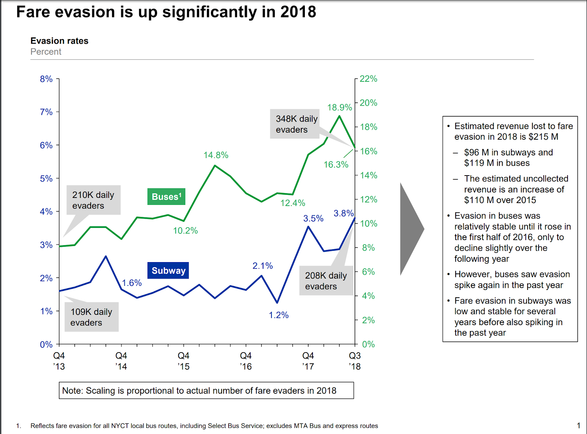

## Turnstile Jump Detection:
[Notebook](https://github.com/muaz-urwa/Projects/blob/master/ComputerVision/PoseEstimation/urwa_TurnstileJumper_demoTest.ipynb)

We want to propose a cost effective automated system to measure (rather than estimate) the fare evasion in subways using security camera footage. We believe that most of the turnstiles are covered by security cameras and this footage is recorded and saved on central servers. We propose to create a software pipeline that consumes video data from these servers and uses computer vision to detect turnstile jumpers and record this information in the database. 

To test the viability of the proposed approach we have developed a proof of concept solution. 
- A small dataset of about 200 images from google image search was prepared. About half pertained to image of a human standing and the other half were of people jumping in the air. 
- For pose estimation pretrained Openpose Model was used. 
- The pose data was cleaned and processed in preparation of pose classification. This transforms image of each person into a 14 dimesional latent space.
- A random forest model was trained for pose classification on 14 dimensional latent space. Results show that in this latent space it is very easy to seperate the walking and jumping people.

Results on static images:

Result metrics for test train split of 50%:

## Demo on Video
### Normal Rider

### Turnstile Jumper

We believe that performance can be improved by:
- Retraining/Fine-tuning the pose estimation model on labelled MTA surveillance data.
- Training the pose classifier on labelled pose estimation data based on MTA video.

This is because every system generate data distribution with some characteristic properties. The patterns of occlusion and angle of capture for MTA surveillance data may be distinctive and thus can us better train the model for this use case,

